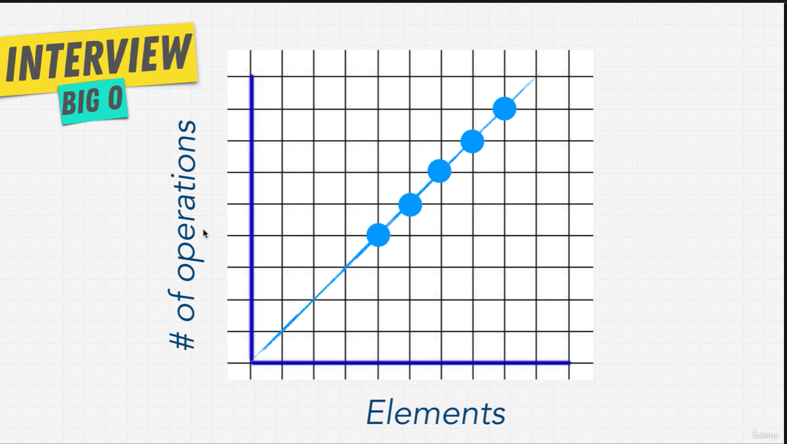

# O que é

A notação Big O é uma ferramenta matemática usada na computação para medir a eficiência e a complexidade assintótica de um algoritmo. Ela descreve o pior cenário de tempo de execução ou uso de espaço à medida que a entrada de dados cresce, permitindo comparar o desempenho de diferentes soluções. 

# O(n)


O(n) representa crescimento linear. Se eu tiver 100 elementos, faço ~100 operações. Se tiver 1000, faço ~1000. Um exemplo clássico é percorrer um array não ordenado para encontrar um valor.

## Exemplo
Ter que encontrar algum elemento em um array, mas ter que percorrer todo o array

# O(1)

```
def compressFirstBox(boxes){
    print(boxes[0])
}
```

O(1) significa que o tempo de execução não cresce com o tamanho da entrada. Independentemente de n, o número de operações permanece constante.


Não é linear como O(n), é **constante**