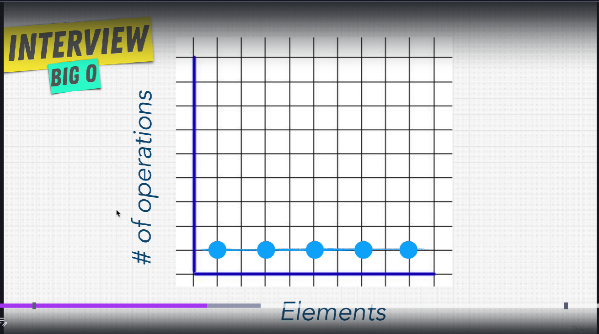

# O que é

A notação Big O é uma ferramenta matemática usada na computação para medir a eficiência e a complexidade assintótica de um algoritmo. Ela descreve o pior cenário de tempo de execução ou uso de espaço à medida que a entrada de dados cresce, permitindo comparar o desempenho de diferentes soluções. 

## Regras:

### Regra 1: Pior caso possível 

Exemplo: ao percorrer um array de strings, a string necessária pode estar na última posição do array, tendo que percorrer ele por completo.

### Regra 2: Remova as Constantes
No Big O, não nos importamos com números precisos, mas com a tendência de crescimento. Se um algoritmo faz dois loops separados de $n$, ele tecnicamente é $O(2n)$. 

No entanto, simplificamos para $O(n)$.Exemplo: $O(n + 50)$ vira $O(n)$; $O(500n)$ vira $O(n)$. Conforme $n$ chega a um milhão, aquele "500" ou "2" torna-se insignificante na curva de crescimento.

```
def compressBoxesTwice(boxes):
    for box in boxes:
        print(box)

    for box in boxes:
        print(box)

```

### Regra 3: Diferentes Entradas, Diferentes Termos
Se a sua função recebe dois arrays (digamos arr1 e arr2) e percorre cada um deles em sequência, a complexidade não é $O(n)$, mas sim $O(a + b)$.

Se forem loops aninhados: $O(a * b)$.

Lembre-se: Você só pode combinar os termos se eles forem baseados na mesma entrada.

```
def compressBoxesTwice(boxes, boxes2):
    for box in boxes:
        print(box)

    for box in boxes2:
        print(box)

```

### Regra 4: Retirar termos não dominantes

Focamos apenas no termo que cresce mais rápido. Se um algoritmo tem uma parte que é $O(n)$ e outra que é $O(n^2)$, a complexidade final é simplesmente $O(n^2)$.

Exemplo: Em $O(n + n^2)$, o $n$ se torna irrelevante para valores massivos de dados. **O $n^2$ é quem "manda" no tempo de execução**.

# O(n)


O(n) representa crescimento linear. Se eu tiver 100 elementos, faço ~100 operações. Se tiver 1000, faço ~1000. Um exemplo clássico é percorrer um array não ordenado para encontrar um valor.

## Exemplo
Ter que encontrar algum elemento em um array, mas ter que percorrer todo o array

# O(1)

```
def compressFirstBox(boxes){
    print(boxes[0])
}
```

O(1) significa que o tempo de execução não cresce com o tamanho da entrada. Independentemente de n, o número de operações permanece constante.



Não é linear como O(n), é **constante**