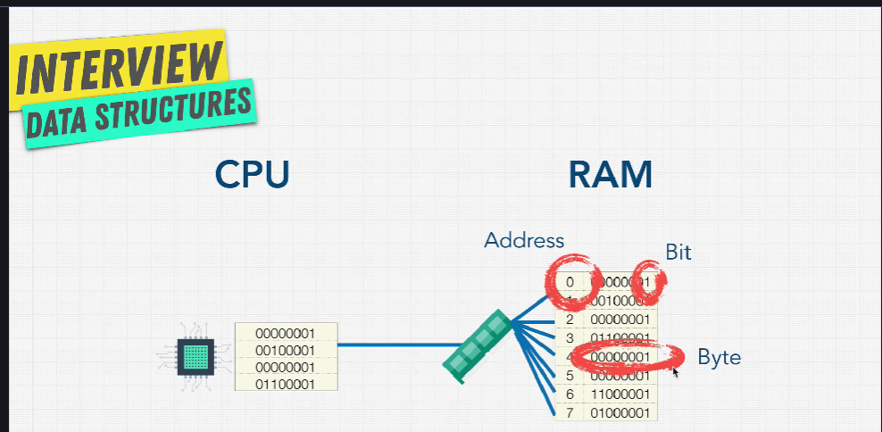

# Como os computadores armazenam dados

## CPU

Pequeno Trabalhador que faz todos os cálculos que precisamos, precisa acessar a RAM e a memória

## RAM

Armazenam variáveis (guarda dados temporários)

## Memória

Armazenam coisas como vídeos, arquivos de música, documentos

Dados são permanentes (persistentes)

